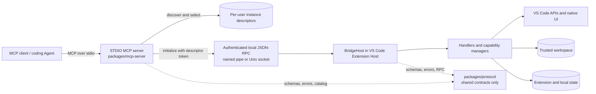

# System architecture

## Runtime and dependency map

There are two runtime layers. `packages/protocol` is linked into both but has no independent process, lifecycle or state.

## Request lifecycle

1. The extension creates a random instance ID, local IPC endpoint and authentication token, then atomically publishes a descriptor.
2. The MCP server discovers live descriptors and requires explicit routing when multiple windows exist.
3. The RPC client authenticates and negotiates the protocol before capability calls.
4. `BridgeHost` validates framing, lifecycle and request envelopes, then dispatches to typed handlers.
5. Handlers validate schema/routing and translate stable errors; managers own VS Code behavior and state transitions.
6. Results return through bounded protocol contracts and then through the MCP tool schema.

When debugging, locate the failing step before editing code. See the [debugging playbook](playbooks/debugging.md).

## Responsibility boundaries

| Boundary | Owns | Must not own |
| --- | --- | --- |
| Protocol package | Schemas, constants, stable errors, RPC framing, registry types, authoritative tool catalog | Runtime state, VS Code APIs, workspace mutation |
| MCP server | STDIO lifecycle, instance discovery, routing, RPC client, MCP result shaping, local aggregate usage records | Direct VS Code behavior or arbitrary workspace access |
| VS Code extension | Descriptor publication, VS Code APIs, trust/policy, experiments, handlers, managers, native UI | MCP STDIO framing or client approval policy |
| Repository scripts | Build/test/package/release orchestration and impact selection | Product behavior or alternate runtime contracts |

## State ownership

| State | Owner and lifetime | Recovery/privacy note |
| --- | --- | --- |
| Instance descriptor/token | Extension publication; per live window | Discovery metadata is sensitive and never returned through MCP |
| Experiment manifests/snapshots | Extension global storage | Content-addressed local recovery journal, not Git or sync |
| Active terminal/Task/Debug capture | Extension memory | Bounded, sanitized and explicitly coverage-aware |
| Workspace text/configuration | VS Code and workspace | Mutations require root/trust/experiment and concurrency guards |
| Managed worktree state | Extension-managed local Git worktree metadata | User-confirmed, no automatic push or broad deletion |
| Usage insight sessions | Local per-process aggregate files | No parameters, results, content, raw paths or credentials |
| Extension Profile undo journal | Extension-local persistent state | Bounded recovery for reviewed configuration changes |

## Security and side-effect invariants

- Authentication is necessary but does not defend against malicious code already running as the same OS user.
- Workspace Trust, exact root containment and preconditions are enforced in the extension, not delegated to the Agent.
- A fixed, typed VS Code action is not permission to expose arbitrary `executeCommand`, DAP, terminal or Git input.
- Tool annotations describe direct and open-world effects. They cannot make external process/database/network effects recoverable.
- Boundedness includes input size, result size, pagination, truncation metadata, timeouts and in-memory retention.
- Capability composition must be threat-modeled. Two individually narrow tools can create a broad effect when chained.

## Changes that cross architecture boundaries

Read the relevant ADR and expect wider validation when a change affects:

- protocol schemas/catalog plus either runtime;
- descriptor/IPC/authentication/version handshake;
- composition roots or lifecycle publication;
- persistent mutation, recovery or path containment;
- Task/Debug/process execution or managed Git;
- packaging/install state or isolated Extension Host profiles.

The impact registry encodes the minimum test escalation, but it does not replace architectural judgment.
