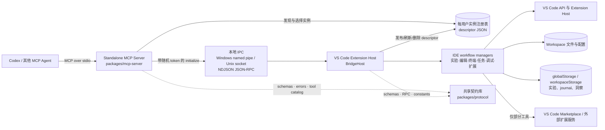
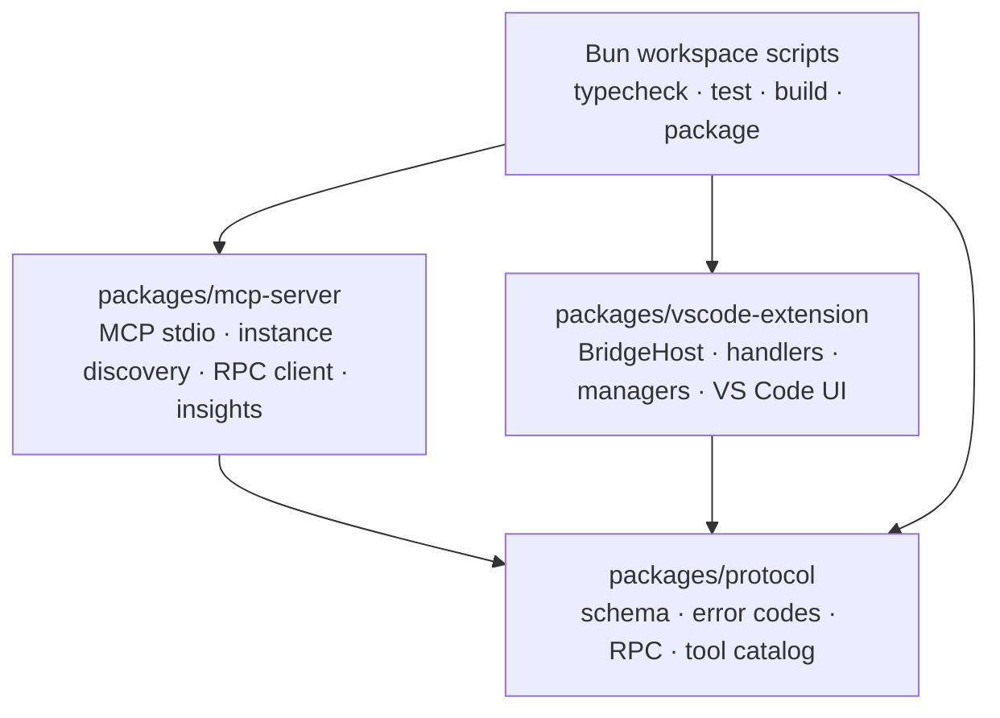
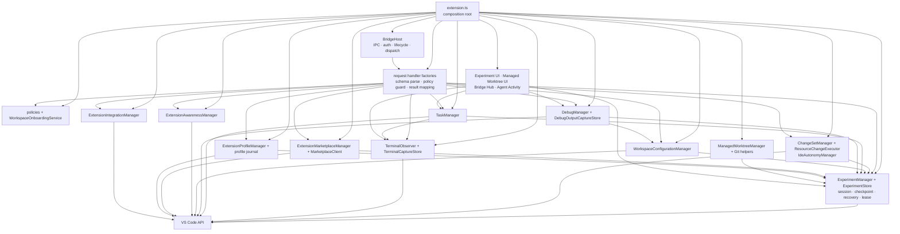
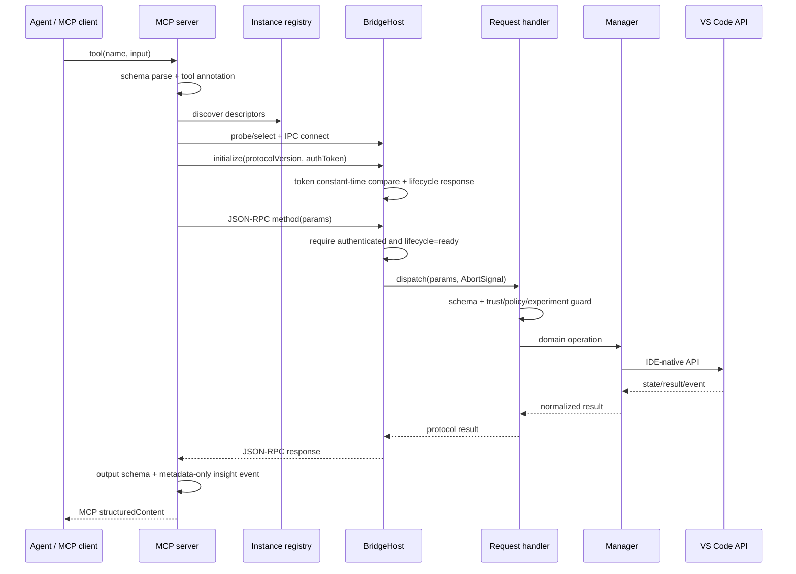
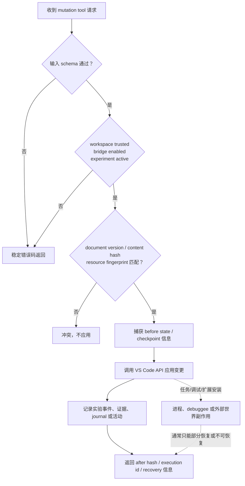
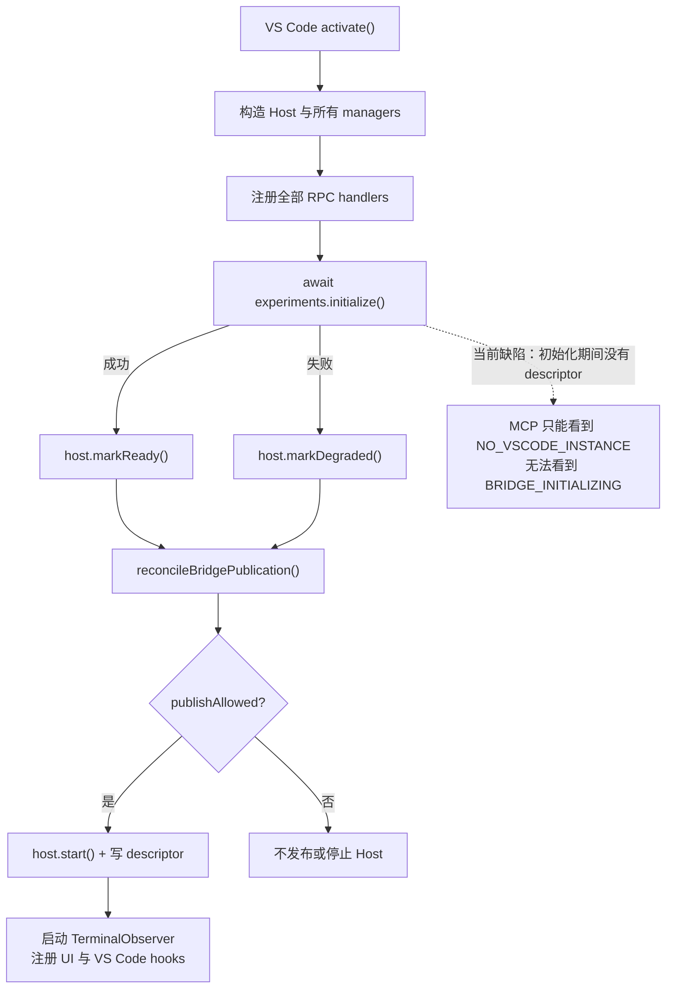
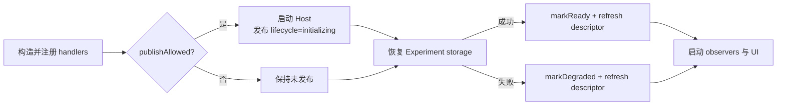
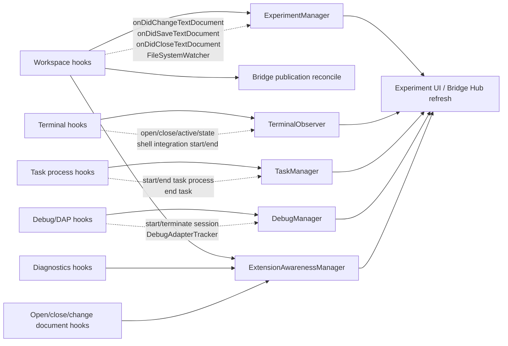

# VS Code Agent Bridge 当前架构与代码审查报告

## 1. 审查元信息

| 项目 | 结论 |
| --- | --- |
| 日期 | 2026-08-10 |
| 状态 | `completed_with_findings` |
| 审查对象 | 当前 `master` 工作树中的 v0.11.0 候选实现 |
| 协议版本 | Bridge protocol v10 |
| 工具规模 | 60 个 MCP tools |
| 环境 | Windows x64、本地可信 VS Code workspace、Bun 1.3.x 工具链 |
| 审查方式 | 源码与 ADR 审查、依赖与事件扫描、单元/构建门禁、扩展 E2E 重复运行、已启动 Bridge 实例自举验证、局部 ACL 检查 |
| 变更范围 | 本报告、审计索引、仓库忽略规则和共享 VS Code workspace settings；未修改产品源码 |

本报告中的“已验证”表示在本次审查环境中直接观察或执行得到；“代码推断”表示从可达代码路径得到、但没有在隔离环境中完成攻击性 PoC；“未验证”表示需要额外平台、身份或发布环境。

## 2. 执行摘要

### 2.1 总体评价

项目的基础架构方向是正确的：独立 MCP server 与 VS Code extension host 分层，`packages/protocol` 作为共享契约库；传输层有实例发现、随机令牌鉴权、协议版本校验、生命周期状态、请求超时和取消；写操作普遍尝试使用实验会话、内容哈希/文档版本、checkpoint 与恢复记录约束副作用。这些都说明项目已经建立了较强的“契约意识”和“可恢复性意识”。

但当前版本尚不具备稳定发布条件。最核心的问题不是某一个函数写得差，而是**多个单独看似受限的能力组合后，越过了项目声明的安全边界**：通用 workspace 配置编辑可以生成可执行 Task/Debug 配置，随后由 IDE 原生执行；extension configuration 可以读取和修改语义敏感但名称未命中正则的配置；URI 与资源路径校验仍存在 workspace 外读取和 junction/symlink 逃逸窗口。与此同时，启动顺序回归、E2E 不可重复、Windows token 文件 ACL 与 Doctor 健康判定又削弱了这些边界的可验证性。

因此，本次审查给出的成熟度判断是：

> **方向正确、契约设计较强的工程候选版；功能广度已经领先于安全闭环、测试隔离和代码可维护性。当前不建议继续扩张能力面，也不建议将 v0.11.0 作为“安全边界已经成立”的稳定版本发布。**

### 2.2 维度评价

以下评分是相对项目目标的审查判断，不是通用行业认证。

| 维度 | 评价 | 主要依据 |
| --- | --- | --- |
| 分层与职责方向 | 4/5 | 两个 runtime layer + 一个共享 protocol，组合根清楚 |
| Wire contract 与错误模型 | 4/5 | Zod schema、稳定错误码、协议版本、tool catalog 较完整 |
| 写操作并发/恢复设计 | 3/5 | 广泛使用 precondition、experiment、checkpoint；仍有 journaling 与路径边界缺口 |
| 安全边界 | 2/5 | 能力组合、URI、配置语义、Windows ACL 存在发布阻断问题 |
| 生命周期与故障可见性 | 2.5/5 | 有 `initializing/ready/degraded`，但启动顺序和 Doctor 判定破坏其价值 |
| 自动化验证 | 3/5 | 106 个单元测试通过；E2E 场景较强但不 hermetic、不可稳定复跑 |
| 用户体验 | 2.5/5 | Bridge Hub、Doctor、usage insights 已成形；实例选择和 output source 噪声较大 |
| 可维护性 | 2.5/5 | 20k 行规模下出现多个 500–1600 行聚合模块，tool registration 仍高度手工化 |
| 发布就绪度 | 2/5 | Windows x64 候选版；跨身份 ACL、重复 E2E、关键安全回归门禁尚缺失 |

### 2.3 优先级结论

1. **立即停止继续增加工具数量**，先关闭配置、路径、URI、ACL 四类边界问题。
2. **把“组合能力”作为威胁模型的一等对象**，不再只审查单个 tool 的声明与实现。
3. **修复启动和测试隔离**，让 `initializing/degraded` 真正可观察，让 E2E 可以在同一机器连续运行两次。
4. 在边界稳定后，再拆分超大模块、声明式生成 tool registration，并改善 Bridge Hub 的信噪比。

## 3. 项目目标与当前实现的吻合度

根据根目录工程约束、README、SECURITY 与 ADR，项目目标可以归纳为：

- 将 Agent 能力接入 VS Code 的 IDE-native state/actions，而不是暴露通用 shell 或任意文件系统；
- MCP server 与 VS Code extension 保持两个 runtime layer，协议包只承载契约；
- 所有 tool 有准确的 schema、错误码、side-effect annotation；
- 修改操作有文档版本或内容哈希前置条件，并能追踪、恢复、审计；
- 可信 workspace、主开关、执行模式和本机实例发现构成最外层策略边界；
- 终端、调试、扩展市场等高风险能力需要清晰的隐私与副作用约束。

当前实现对前四项目标已经投入了大量工程工作，但“不是通用 shell/文件系统”目前只在单项 API 形态上成立，在能力组合后并不成立；annotation 也主要描述了直接调用的即时副作用，尚未覆盖“写入配置后由 VS Code 延迟执行”的二阶副作用。这是当前项目目标与实现之间最大的偏差。

## 4. 当前总体架构

### 4.1 系统上下文与运行时边界

架构上的关键优点是：Agent 不直接加载 VS Code extension 代码；MCP server 也不直接操作 workspace，而是通过本地、带协议版本和 token 的 RPC 请求 extension host。关键风险是：descriptor 同时承担发现和 bearer token 分发，因此其 Windows ACL 是真实安全边界，而不只是实现细节。

### 4.2 包级依赖

`packages/protocol` 的定位正确：它不是第三个服务，而是两个 runtime 的共同事实来源。当前值得改进的是 MCP server 内部仍手工注册 60 个工具，导致 catalog、schema、handler routing 和 server registration 之间存在多份映射。

### 4.3 Extension 内部模块依赖

这里的中心依赖已经非常明显：`extension.ts` 是组合根，`ExperimentManager` 是几乎所有 mutation workflow 的状态核心，`WorkspaceConfigurationManager` 又成为 Debug 与 Task 可执行配置的间接入口。这两个中心点同时承担过多职责，是风险扩散和测试困难的主要原因。

## 5. 模块职责与边界

| 模块 | 当前职责 | 主要输入/输出 | 审查评价 |
| --- | --- | --- | --- |
| `packages/protocol` | 协议版本、Zod schema、错误码、RPC、tool catalog | 纯数据契约 | 边界清楚，是项目最稳固部分之一 |
| `mcp-server/src/index.ts` | 创建 MCP server、注册 60 tools、参数/结果桥接 | stdio MCP ↔ Bridge RPC | 功能集中，1421 行；注册方式重复且依赖 `any` monkeypatch |
| `mcp-server/src/instances.ts` | 读取 descriptor、探活、选择实例 | registry JSON ↔ live instance | 行为易懂；旧协议 descriptor 被静默忽略且不清理 |
| `mcp-server/src/rpc-client.ts` | 建立 IPC、initialize、超时/取消、响应解析 | descriptor token ↔ NDJSON RPC | 连接级防护较完整；每次典型转发创建短连接，简单但有额外探活/连接成本 |
| `BridgeHost` | 监听 IPC、鉴权、lifecycle、dispatch、descriptor | RPC ↔ handler map | 模型合理；当前启动顺序让 `initializing` 状态失去可发现性 |
| `ExperimentManager/Store` | 会话、snapshot、checkpoint、证据、恢复、lease、Git 观察 | VS Code events ↔ storage/workspace | 项目能力核心，但 1644 + 981 行，职责和故障域过大 |
| `ChangeSetManager/ResourceChangeExecutor` | 准备和应用文本/资源变更、校验 hash/version | Agent edit ↔ workspace | precondition 思路正确；真实路径边界不足 |
| `WorkspaceConfigurationManager` | JSON pointer 更新 settings/tasks/launch/workspace | structured patch ↔ config files | 通用性过强，成为进程执行能力的“配置编译器” |
| `TerminalObserver/Capture` | 观察 terminal 与 shell integration、净化/保留输出 | VS Code terminal events ↔ bounded memory | 不提供 terminal input 是正确选择；需持续核对覆盖率和敏感数据策略 |
| `TaskManager` | 列举、指纹、运行、终止、观察 Task | task fingerprint ↔ process lifecycle | 单独看边界较强；与配置写入组合后可形成通用 shell |
| `DebugManager` | 配置发现、启动/控制 session、DAP 观察、输出捕获 | launch config ↔ debuggee | 能力强且副作用复杂；与 launch.json 写入组合后边界扩大 |
| Extension orchestration | 扩展清单、输出源、Marketplace、Profile、Integration | extension metadata/config/network | 功能覆盖快，但语义安全 allowlist 与 UX 筛选尚未跟上 |
| UI modules | Hub、Doctor、实验/工作树操作、活动状态 | manager state ↔ 用户界面 | 已形成可用入口；健康判定与信噪比仍需校正 |

## 6. 请求、数据与副作用流

### 6.1 典型 MCP 请求流

请求流的优点是每一层都能做契约校验；缺点是 annotation 在最外层静态定义，而真实副作用由最内层 VS Code provider、第三方 extension 或延迟 Task/Debug 行为决定，两者可能发生语义漂移。

### 6.2 修改工作流

当前最重要的不一致是：文件编辑路径基本遵循“precondition → before → apply → record”，但 Profile 配置更新是先 `configuration.update` 再 append journal；若记录失败，持久化修改已经发生。Task/Debug 的外部副作用也无法由文件 checkpoint 完整恢复。

### 6.3 主要数据存储

| 数据 | 位置/载体 | 敏感性 | 生命周期 | 当前问题 |
| --- | --- | --- | --- | --- |
| Instance descriptor | 每用户本地 registry JSON | 高：包含 bearer auth token、workspace 元数据 | host start 写入，refresh 更新，stop 删除 | Windows DACL 未显式收紧；旧协议/无效文件残留 |
| IPC endpoint | named pipe / Unix socket | 高：本地控制通道 | host 监听期间存在 | 依赖 descriptor token；同机身份模型需与 ACL 一致 |
| Experiment manifest/snapshot/checkpoint | extension storage + workspace 资源 | 源码/工作区元数据 | 会话创建到 finalize/abandon/清理 | 恢复设计较强，但 manager/store 复杂度高 |
| Profile change journal | extension global storage | 可能含配置值 | 修改后 append，undo 时读取 | 先改后记；并发 read-modify-write 可丢记录 |
| Terminal/debug capture | 内存与受限事件结构 | 高：终端和 debug 数据 | TTL/容量约束、extension 生命周期内 | 需要持续验证净化和 coverage 声明 |
| Usage insights | 本地 JSONL | 元数据：tool、结果桶、延迟桶、大小桶 | 按 retention/总量清理 | 仅进程首次 append 时 prune；活跃文件可越过总量上限 |
| Workspace settings/tasks/launch | 工作区文件 | 源码 + 可执行配置 | 持久化并可被 VS Code 延迟消费 | “配置写入”可能升级为未来进程执行 |

## 7. 生命周期

### 7.1 Extension 当前激活顺序

`BridgeHost` 本身支持 `initializing → ready/degraded`，且非 `ready` 请求会返回 `BRIDGE_INITIALIZING` 或 `BRIDGE_DEGRADED`。但 `extension.ts:106-120` 在启动 Host 之前等待 storage initialize，违反 ADR 0011 中“先让 initializing 状态可发现”的设计意图。历史实现曾先 `host.start()`，当前顺序属于功能回归。

建议的生命周期顺序是：

### 7.2 连接生命周期

```mermaid
stateDiagram-v2
    [*] --> Unauthenticated: socket accepted / 10s timeout
    Unauthenticated --> Authenticated: initialize + token valid
    Unauthenticated --> Closed: invalid request / auth failed / timeout
    Authenticated --> InitializingBlocked: host lifecycle=initializing
    Authenticated --> DegradedBlocked: host lifecycle=degraded
    Authenticated --> Handling: host lifecycle=ready + known method
    Handling --> Handling: concurrent pending requests
    Handling --> Authenticated: result/error; pending=0; restore 10s timeout
    Handling --> Closed: socket close; AbortController.abort()
    Authenticated --> Closed: idle timeout / client close
    InitializingBlocked --> Authenticated: error returned
    DegradedBlocked --> Authenticated: error returned
    Closed --> [*]
```

### 7.3 停用与策略重配置

- `deactivate()` 依次释放 TerminalObserver、异步释放 ExperimentManager、停止 Host。
- `vscodeAgentBridge.enabled`、`executionMode`、`autonomyProfile`、`terminalReadPolicy` 变化会进入串行 reconcile queue。
- workspace 获得 trust 时重新 reconcile；workspace folder 变化时只刷新 descriptor。
- 主开关关闭会关闭 active sockets 并删除 descriptor，但不会撤销之前写入的 deferred workspace configuration；UI 已提示这一点。
- Host stop 会销毁连接并删除当前 descriptor；MCP side 会在探活失败时清理部分当前协议 descriptor，但无法处理 schema 已不兼容的旧 descriptor。

## 8. VS Code 钩子与观察链

| VS Code hook | 消费模块 | 用途 | 审查关注点 |
| --- | --- | --- | --- |
| `onDidChangeWorkspaceFolders` | `extension.ts` | 刷新 descriptor workspace 列表 | 只在 Host 已监听时刷新，行为合理 |
| `onDidGrantWorkspaceTrust` | `extension.ts`、TerminalObserver、Bridge Hub | 重新发布、刷新终端覆盖和 UI | trust 仅有“授予”事件；失去 trust 的实际模型需由配置/窗口生命周期兜底 |
| `onDidChangeConfiguration` | `extension.ts`、TerminalObserver | 主开关/模式 reconcile、捕获策略刷新 | 需要防止频繁变化造成状态短暂漂移，当前使用 queue 是正向设计 |
| `onDidChange/Save/CloseTextDocument` | ExperimentManager | 记录人工编辑、保存状态、同步 session | manager 中 debounce、lease、Git、watcher 聚合过多 |
| `createFileSystemWatcher` create/change/delete | ExperimentManager | 捕获外部文件变更 | 与文本事件可能重复，需要明确去重和 ordering contract |
| lease/Git `setInterval` | ExperimentManager | lease 续期、Git HEAD 观察 | dispose 与长任务竞争应有定向测试 |
| Terminal open/close/active/state/shell integration | TerminalObserver | 建立 terminal/execution inventory 与输出覆盖 | API coverage 不完整时必须准确标注，不能把“未捕获”解释为“无输出” |
| Task process start/end、task end | TaskManager | execution 状态和 terminal 关联 | 进程可能来自 Agent 之外，fingerprint/provenance 必须可靠 |
| Debug session start/terminate、DAP tracker | DebugManager | session 状态、输出、变量/控制协议 | DAP 消息和表达式可能包含高敏感内容 |
| Diagnostics change、document open/close/change | ExtensionAwarenessManager | diagnostic events、output document 观察 | 默认输出源清单被 extension capability 元数据淹没 |
| Experiment `onDidChange`、diagnostics、terminal、debug、documents | Bridge Hub/UI | 刷新 tree views | 多个事件直接 refresh，后续应关注合并与大 workspace 成本 |

## 9. 详细问题清单

### F-01 [高｜发布阻断] Extension configuration 不是语义安全边界

**证据**

- `extension-profile-core.ts:63-69` 只按 key 名称拒绝 `token/password/secret/credential/api-key` 等模式。
- `extension-profile-manager.ts:33-59` 会返回实际 `effectiveValue` 和 `targetValue`，并固定标记 `sensitive: false`。
- 本次通过已启动 Bridge 读取 schema 时，发现未命中该正则但语义敏感的真实配置：遥测 headers（描述明确称可能含认证凭证）、workspace 外额外读取路径、进程 wrapper 路径、SSH executable 路径。
- global target 没有 extension/key 语义 allowlist；workspace/workspaceFolder 虽有 scope 限制，但 global 仍可修改 application/machine 级行为。
- Profile 更新先执行 `configuration.update`，之后才 append journal；journal 是无串行队列的 read-modify-write。

**影响**

Agent 可以读取未被名称正则识别的敏感值，或修改会影响进程启动、网络、workspace 外访问的配置。即使没有直接 shell tool，也可能通过第三方 extension 配置扩大权限。journal 写失败或并发覆盖还会使 undo 记录不完整。

**建议**

1. 默认拒绝所有 extension configuration 读写，只开放经过评审的 `extensionId + key + target` allowlist。
2. schema 返回可以保留，但值读取默认只返回 `defined + sha256`，不得返回 raw value；确需读取的键单独授权。
3. 增加语义分类：credential、network endpoint/header、executable/wrapper、outside-workspace path、trust/security、telemetry export；分类拒绝优先于名称正则。
4. 先写 `pending` journal，再修改配置，成功后提交；失败时回滚。所有 journal 操作串行化并用原子写替换。
5. 将该 tool 标为 open-world 或拆分成按 capability 审批的多个工具。

### F-02 [高｜发布阻断] 配置写入 + Task/Debug 执行重新构成通用 shell

**证据**

- `WorkspaceConfigurationManager` 接受对 `settings/launch/tasks/workspace` 的通用 JSON pointer 操作。
- `validateConfigurationContent` 只识别 deferred Task 自动执行；`explicit` 拒绝，`aggressive` 允许。
- E2E 自身在 `extension.e2e.ts:1112-1160` 通过该能力写入一个 `powershell.exe -Command ... Set-Content` Task，随后列举并运行它，证明组合链路是设计内可达而非理论猜测。
- 同样可以写入 `launch.json` 后调用 `vscode.debug.startDebugging`。
- catalog 将 `vscode_update_workspace_configuration` 标为 closed-world、可完整恢复的 guarded workspace write；但 deferred Task 可在稍后、没有新的 `vscode_run_task` 调用时启动进程。

**影响**

项目宣称“不暴露通用 shell”，但 Agent 可以间接生成并执行任意命令。对于 aggressive 模式，实际进程副作用甚至可能与原始 MCP approval 脱钩；文件恢复也不能撤销已经发生的进程、网络或外部文件副作用。

**建议**

1. 禁止通用配置工具写入 execution-bearing 字段：Task `command/args/dependsOn/runOptions`，Debug `program/runtimeExecutable/args/env/pipeTransport` 等。
2. 若未来确需生成 Task/Debug，采用专用 schema、固定 executor allowlist、参数级约束和显式一次性用户确认。
3. 为 Agent 生成的配置写入 provenance 标识；TaskManager/DebugManager 默认拒绝执行 Agent 生成且未单独批准的配置。
4. 在新审批模型完成前移除或禁用 `aggressive` deferred execution。
5. 修正 annotation：配置写入可能 open-world，recoverability 只能覆盖配置文件，不能覆盖执行副作用。

### F-03 [高｜发布阻断] workspace 路径校验可被 symlink/junction 父链绕过

**证据**

- `resource-change-executor.ts:281-299`、`change-set-manager.ts:419-443` 与 Experiment 路径处理主要使用 `path.relative(path.resolve(root), path.resolve(candidate))` 做词法包含判断。
- `assertPlainResource` 检查当前存在资源的类型，但对“目标尚不存在、父目录是 junction/symlink”的情况没有逐级检查。
- 写入最终交给 `vscode.workspace.fs.writeFile` 或 `openTextDocument`，文件系统会跟随父目录重解析点。

**影响**

代码推断表明：workspace 内的 junction 指向 workspace 外目录时，Agent 可以准备一个 junction 下尚不存在的目标，词法路径仍在 root 内，实际写入却落到 root 外。这会破坏所有“workspace-scoped mutation”的核心假设。

**建议**

1. 对 workspace root 取 realpath，并对候选的最近存在祖先取 realpath，确认其仍在 root 下。
2. Windows 上逐级拒绝 reparse point/junction；POSIX 上拒绝 symlink 父链，除非引入明确且受测的安全跟随策略。
3. create/rename/delete/edit 共用一个 canonical path boundary 模块，避免三套近似实现漂移。
4. 增加 Windows junction、directory symlink、file symlink、case folding、UNC/drive boundary 的测试。

### F-04 [高｜发布阻断] 读与语言服务工具接受 workspace 外和 provider-backed URI

**证据**

- `language-services.ts:213-243` 接受任意可解析 URI；如果文档未打开，则直接 `vscode.workspace.openTextDocument(parsedUri)`。
- 未限制 `file:` 必须在 workspace realpath 内，也未限制 scheme allowlist。
- symbols/definition/reference/hover 通过固定 `vscode.execute*Provider` command 调用 language providers，可能激活并执行第三方 extension。
- catalog 将这些工具标为 closed-world、idempotent read-only。

**影响**

Agent 可能读取 workspace 外文本文件或调用任意已注册 FileSystemProvider scheme；provider-backed “读取”可能激活第三方扩展、访问网络或产生自身副作用。静态 annotation 低估了 open-world 行为。

**建议**

1. 默认只允许已打开文档，或 realpath 位于已授权 workspace root 下的 `file:` URI。
2. 对 virtual document scheme 建立 reviewed allowlist，并在 capability 中明确披露。
3. provider-backed language tools 标为 open-world、非幂等提示，或在首次激活 provider 时要求额外批准。

### F-05 [高] 启动顺序使 `BRIDGE_INITIALIZING` 不可观察，Doctor 又可能假健康

**证据**

- ADR 0011 要求先启动 authenticated host，再恢复 experiment storage，使 `initializing` 可被发现。
- 当前 `extension.ts:106-120` 先 `await experiments.initialize()`，再 reconcile/start Host。
- `BridgeHost` 已实现 initializing/degraded 错误，但初始化期间没有 descriptor，MCP 只能得到 `NO_VSCODE_INSTANCE`。
- `runDoctorCommand` 输出 corrupt/recovery/managed attention 数据，但 `healthy` 条件只检查平台、版本、policy、listening、安装和配置；不检查 `host.lifecycle`、corrupt experiments、recovery required 或 managed attention。

**影响**

慢恢复和故障恢复的用户体验退化为“找不到 VS Code”；Doctor 可能在 Bridge 已 degraded 或 storage 需要恢复时仍提示所有 release checks passed，削弱诊断可信度。

**建议**

1. handlers 注册完成且策略允许后立即 `host.start()`，再 initialize store，最后 `markReady/markDegraded`。
2. 为慢 initialize、失败 initialize、禁用状态、trust 变化增加定向生命周期测试。
3. Doctor 健康条件纳入 lifecycle、corrupt/recovery/managed attention；把“安装健康”“Bridge 运行健康”“workspace 数据健康”分开显示。

### F-06 [高｜Windows 发布阻断] Bearer token descriptor 未显式设置 owner-only DACL

**证据**

- `bridge-host.ts:84-85` 和 descriptor 写入使用 POSIX `mode` 语义；Windows 不会由此自动获得所需 DACL。
- 本次 ACL 检查确认 registry 目录与 descriptor 继承了额外本地 sandbox group 的读取/执行权限。报告未记录 token、endpoint 或具体用户名。
- descriptor 包含 RPC bearer token；读取 descriptor 等价于获得 Bridge 调用能力。

**影响**

实际信任边界可能大于“当前用户”。这与 owner-only/best-effort 的设计意图不一致，也会使恶意同机受限身份的风险假设变得不清晰。

**建议**

1. Windows 使用原生安全描述符显式设置仅当前用户和必要系统主体可读的 DACL，不依赖继承 ACL。
2. 写文件时采用 create-private → fsync/close → atomic rename，并在 rename 后复查 DACL。
3. 用另一个受限 token/用户做正反验证：所有者可读，非所有者不可读且无法连接 named pipe。
4. SECURITY/threat model 明确同机身份边界及 Windows 实际保证。

### F-07 [高] Extension E2E 不可重复且失败路径泄漏临时目录

**已验证结果**

- `bun run check`：通过，106 tests passed、0 failed，三个 workspace 完成 typecheck/test/build。
- 第一次 `bun run test:e2e`：内部 Mocha 输出 `2 passing (57s)` 且 child exit 0，但外层命令在约 60.3 秒达到执行器时限；该结果只能记为“内部通过、外层超时”。
- 立即以 90 秒时限复跑：`1 passing, 1 failing`，在 `exerciseExtensionProfileConfiguration` 的 `false !== true` 断言失败。

**根因**

- `extension.e2e.ts:759` 将 global `vscodeAgentBridge.enableAcceptanceFixtures` 设置为 `true`，没有恢复。
- 后续 profile scenario 再次把同一配置设为 `true` 并断言 `changed === true`；复跑时初始值已经是 `true`。
- E2E 复用 `.vscode-test/user-data`，因此测试顺序和上一次运行状态会影响结果。
- `scripts/run-extension-e2e.ts` 与 VSIX runner 在 helper 内调用 `process.exit(exitCode)`；失败时会跳过外层 `finally`，本次实际留下了一个 `%TEMP%/vscode-agent-bridge-e2e-*` 目录，确认目标边界后已删除。

**建议**

1. 每次 E2E 创建独立 user-data/extensions/workspace 临时根，不复用仓库内 `.vscode-test/user-data`。
2. 测试设置用 `try/finally` 保存并恢复原值；断言最终语义状态，不依赖“之前一定不是 true”。
3. helper 返回 exit code 或抛错，由最外层 `finally` cleanup 后统一设置 `process.exitCode`，不要在 helper 中 `process.exit()`。
4. CI 门禁连续运行 E2E 两次，并断言无 `vscode-agent-bridge-e2e-*` 残留。

### F-08 [中] Usage insights 的 20 MiB 上限不是持续不变量

**证据**

- `usage-insights.ts:67-75` 每个进程只在第一次 append 时 prune。
- 总量清理会跳过 active file；active file 在长生命周期进程中可以持续增长并越过 `MAX_TOTAL_BYTES`。
- 写入通过内存 queue 异步串行，但进程退出路径没有明确 drain contract，最后事件可能丢失。

**影响**

文档中的容量承诺并非硬上限；长期 MCP 进程可能持续增长。数据虽为 metadata bucket，仍属于本地可观察使用记录。

**建议**

- 按累计字节/时间周期触发 prune，active file 达阈值时 rotate；shutdown 显式 drain 或记录“best effort”。
- 测试单活跃文件越界、并发 record、重启后 prune 和 shutdown flush。

### F-09 [中] 旧协议 descriptor 会静默残留并被表现为“无实例”

**证据**

- `InstanceDescriptorSchema` 把 protocol version 固定为当前 v10。
- `instances.ts:28-44` 对 parse 失败的 JSON 直接返回 null，不删除、不报告版本信息。
- 本次 registry 检查发现 4 个不可用旧 descriptor（protocol 3/5）与 2 个 live v10 descriptor 并存。

**影响**

升级不兼容会被折叠为 `NO_VSCODE_INSTANCE`，用户看不到明确 `PROTOCOL_MISMATCH`；旧文件长期积累，也扩大 token/元数据残留面。

**建议**

- 先用宽松 envelope 解析 `protocolVersion/instanceId/updatedAt`，再区分 current、stale、unsupported、corrupt。
- 过期/不可连接 current descriptor 自动删除；旧协议记录隔离或清理，并向用户返回版本不匹配诊断。

### F-10 [中] Output source inventory 的默认结果信噪比过低

**证据**

- 本次 live Bridge 返回 74 个 output sources，绝大多数来自 extension capability inventory，标记为 `metadataOnly`，并不可读取。
- `ExtensionAwarenessManager` 默认追加所有 capability 后按字母排序。

**影响**

Agent 和用户需要在大量“知道存在但不能读取”的条目里寻找真正可操作的 terminal/debug/output document 源，增加 token 成本和错误选择。

**建议**

- 默认只返回 readable/actionable sources；`includeMetadataOnly` 显式开启后才返回完整能力清单。
- 分离“output inventory”和“extension capability inventory”，排序优先级为可读、当前活跃、最近更新、元数据。

### F-11 [中] 核心模块和 MCP 注册已经超过适合继续野蛮扩张的复杂度

**已验证规模**

- `packages/*/src`：69 个 TypeScript 文件，约 20,120 行。
- 最大文件：`experiment-manager.ts` 1644 行、`mcp-server/src/index.ts` 1421 行、`experiment-store.ts` 981 行、`extension.ts` 723 行、`managed-worktree-manager.ts` 677 行、`debug-manager.ts` 与 `extension-awareness-manager.ts` 各 600 行。
- 29 个 unit test 文件 + 1 个 E2E 文件；约 105 个直接 test declarations。两个 E2E scenario 承担了大量跨模块行为。
- `mcp-server/src/index.ts:127-146` monkeypatch `server.registerTool` 并使用 `any`，其后手工注册全部工具。
- 当前 scripts 没有 lint、format check、coverage 或 complexity gate。

**影响**

新增功能容易同时修改 protocol、catalog、MCP registration、handler、manager、E2E；手工映射错误更难被定位。关键模块缺少定向 unit tests，失败只能在耗时且有状态的 E2E 中暴露。

**建议**

1. 从声明式 tool definition 生成 catalog metadata、MCP registration、input/output parser 与 method mapping；保留 STDIO contract test 验证 60 个公开名称。
2. 按 lifecycle/recovery/snapshot/watcher/lease 拆分 ExperimentManager，但保持外部接口不变，采用小步可回滚提交。
3. 抽出共享的 canonical path boundary、atomic journal、serialized mutation queue。
4. 为 BridgeHost、workspace config、change set/resource、task/debug、profile journal 增加 focused unit/integration tests。
5. 增加 lint、format check、coverage baseline；复杂度 gate 先只报告，再逐步强制。

### F-12 [中] 文档、安全声明与仓库卫生已经落后于功能演进

**证据**

- 根 `SECURITY.md` 仍把支持线写为 0.9.x，当前版本已是 0.11.0。
- 包内安全说明仍强调“无 shell execution”，没有覆盖 v0.10 Marketplace/Profile 与 v0.11 extension integration 带来的组合风险。
- README 的“不提供 unrestricted filesystem/shell”与 Task/Debug/config 组合能力不一致。
- 审查开始时，onboarding 已使 tracked `.vscode/settings.json` 出现项目配置改动；根 `.gitignore` 未覆盖 `.codex/`、`.idea/` 等本地工具状态，工作树已出现这些未跟踪项。本次配置治理已将可共享的 Bridge workspace settings 纳入版本控制，并把含本机路径/端点的 `.codex/` 与 JetBrains `.idea/` 整体加入忽略规则。

**影响**

用户会按照过期的安全模型做决策，开发者也难以判断哪些本地状态应该提交。版本快速推进但安全说明未同步，会形成错误的成熟度预期。

**建议**

- 每个 release gate 强制检查 README、SECURITY、threat model、ADR 与 tool catalog 是否一致。
- 保持当前边界：`.vscode/settings.json`、`tasks.json`、`launch.json` 中可移植的项目级设置纳入版本控制；`.codex/` 和 `.idea/` 作为本机运行/IDE 状态忽略。当前 `typescript@7.0.2` 包不包含 VS Code 所需的 `lib/tsserver.js`，因此本次移除了无效的 `typescript.tsdk` 与 workspace SDK prompt，让编辑器使用 VS Code 内置 TypeScript；Bun 构建仍使用项目锁定版本。若未来需要共享 Codex 项目模板，应使用不含绝对路径、端点或凭证的独立示例文件，而不是解除整个目录的忽略。
- 当前仍是单 Git 根、单 Bun workspace 根，继续使用仓库级 `.vscode/` 即可；不要仅因 package 数量增加就引入 `.code-workspace`。只有需要同时打开仓库外 fixture、多个独立仓库/managed worktree，或不同 folder 必须使用不同设置时，再引入可移植的 multi-root workspace 文件。
- 在安全文档增加“能力组合分析”章节，逐项列出直接副作用、延迟副作用、第三方 provider 副作用和可恢复范围。

## 10. 验证结果矩阵

| 检查项 | 结果 | 证据/备注 |
| --- | --- | --- |
| `bun run check` | PASS | typecheck、106 tests、build 全部通过；673 个 expect calls，0 fail |
| Extension E2E 第一次 | CONDITIONAL | 内部 `2 passing (57s)`、child exit 0；外层约 60.3s 超时 |
| Extension E2E 立即复跑 | FAIL | `1 passing, 1 failing`；global setting 污染导致 `false !== true` |
| 失败路径临时目录清理 | FAIL → 手工恢复 | runner 未执行 finally；残留目录经边界确认后删除 |
| Live Bridge 自举 | PASS with findings | 2 个 live v10 实例、trusted workspace、60 capabilities、当前 diagnostics 为 0 |
| Usage insights 观察 | PASS with UX findings | 小样本 45 calls：34 success、11 rejected；`NO_VSCODE_INSTANCE` 占 7 次 |
| Workflow closure 观察 | FINDING | prepared 1、applied 0、saved 0、validated 1、checkpointed 0；样本小，不能外推整体使用率 |
| Output source inventory | FINDING | 74 sources，绝大多数 metadata-only extension capability |
| Windows descriptor ACL | FAIL | 继承额外本地 group read/execute；未达到可证明 owner-only |
| Junction/symlink escape PoC | NOT RUN | 源码路径可达性成立；需在隔离目录和受控外部目标上补 PoC |
| 跨平台/remote extension host | NOT RUN | 当前发布目标为本地 Windows x64；代码明确提示 remote routing 未支持 |
| VSIX 安装/升级/卸载矩阵 | NOT RUN in this audit | 既有发布审计已覆盖部分候选流程；本报告聚焦当前架构与代码风险 |

## 11. 用户视角问题

除了安全问题，当前使用体验有三类明显摩擦：

1. **实例选择过于暴露底层实现。** 同时打开多个 VS Code window 时，Agent 必须提供 `instanceId`；usage sample 中大量 `NO_VSCODE_INSTANCE` 说明实例发现、重载和旧 descriptor 对用户仍不透明。建议增加 workspace path/title 的安全摘要选择与最近实例提示，而不是要求用户手工复制 UUID。
2. **能力“看得见但用不了”。** Output source 默认返回大量 metadata-only 条目；Marketplace/实验升级等错误虽有稳定 code，但下一步动作不总是直接可执行。应把可读、可执行、需升级、需用户动作区分为一级 UI 状态。
3. **工作流闭环不明显。** 当前小样本中 prepare/apply/save/checkpoint 链不完整。工具很多，但 Agent 容易停在“准备了变更”或“做了验证”而未形成清晰 checkpoint。建议让 Hub 和 tool result 明确返回 next safe actions，同时避免把 UI 引导变成自动执行。

## 12. 建议的整改路线

### Phase 0：发布冻结与边界止血

- 暂停新增 MCP tools 和新的 extension orchestration capability。
- 默认禁用通用 extension config raw value 读取、通用 tasks/launch execution-bearing 写入、aggressive deferred execution、workspace 外 URI。
- 新增临时 release blocker 清单，F-01 至 F-07 未关闭前不提升稳定版本标签。

### Phase 1：安全边界闭环

- 新建 ADR：能力组合威胁模型、configuration allowlist、canonical path policy、Windows descriptor/pipe identity model。
- 实现统一 realpath/reparse boundary 并覆盖所有 read/edit/create/rename/delete/experiment 路径。
- Profile journal 改为 pending/commit/rollback 状态机和串行原子写。
- Tool annotation 从“直接 API 副作用”升级为“最坏可达副作用”；provider-backed 读取标记 open-world。
- Windows DACL 和 alternate-token 测试进入发布门禁。

### Phase 2：生命周期与测试可信度

- 恢复 Host-before-storage-recovery 顺序；Doctor 拆分安装、运行、数据健康。
- E2E 每次创建独立 user-data，所有配置恢复，runner 不在 helper 中 `process.exit()`。
- CI 连续执行两次 E2E，并检查临时目录、descriptor、进程和配置残留。
- 为 initializing/degraded、取消、stop/reconcile、并发 request 增加 BridgeHost 集成测试。

### Phase 3：结构治理与可维护性

- 声明式 tool registry；自动验证 catalog ↔ MCP ↔ RPC method ↔ result schema 一致。
- 在不改变外部契约的前提下拆分 ExperimentManager/Store；每个拆分点单独提交、单独回归。
- 将路径、journal、mutation queue、provenance 变成共享基础设施。
- 引入 lint/format/coverage baseline，并为关键 manager 增加 focused tests。

### Phase 4：体验与发布验证

- Bridge Hub 默认显示 actionable/readable 信息，完整 capability inventory 按需展开。
- 改善多实例选择和旧 descriptor 诊断，提供明确 `PROTOCOL_MISMATCH`/stale 状态。
- 做干净 Windows 用户、受限用户、升级、卸载、双窗口、workspace trust、长路径/junction、远程环境的矩阵验证。
- 更新 README、SECURITY、threat model、ADR 和发布清单，使声明与实际组合能力一致。

## 13. 建议的发布验收门槛

只有同时满足以下条件，才建议把当前候选版视为可发布：

1. F-01 至 F-07 均有实现修复、定向测试和 ADR/安全文档闭环。
2. `bun run check` 通过；Extension E2E 在干净环境连续运行两次均通过。
3. E2E 前后没有遗留 temp directory、descriptor、VS Code 测试进程或 global setting 污染。
4. workspace junction/symlink、workspace 外 URI、extension config 敏感键均有负向测试。
5. Windows alternate-token 验证无法读取 descriptor、无法使用 token、无法未授权连接 pipe。
6. Doctor 在 initializing、degraded、corrupt、recovery required、managed attention 状态下不会报告全健康。
7. tool catalog annotation 与最坏可达副作用一致，尤其是 config、language provider、Task、Debug 和 extension tools。
8. README/SECURITY 明确当前支持平台、已知限制、同机身份模型、第三方 provider 与能力组合风险。

## 14. 本次审查副作用与保留项

- 创建本报告并更新 `docs/audits/README.md` 索引。
- 更新根 `.gitignore`：忽略本机 `.idea/` 与 `.codex/`；保留已跟踪的 `.vscode/` 团队配置。
- 将 onboarding 产生的 `vscodeAgentBridge.experiments.enabled=true` 与 `vscodeAgentBridge.agentEditVisibility=focusFirst` 作为该仓库自举开发设置保留在 `.vscode/settings.json`。
- 移除指向不存在 `node_modules/typescript/lib/tsserver.js` 的 workspace `typescript.tsdk` 设置及其 SDK prompt；编辑器回退到 VS Code 内置 TypeScript，不改变 Bun typecheck/build 所用依赖。
- E2E 使用了仓库忽略的 `.vscode-test/user-data`，其中 global setting 状态被测试改变；未将其纳入提交。
- 失败 E2E 遗留的 `%TEMP%/vscode-agent-bridge-e2e-*` 目录已在确认目标属于受控前缀后删除。
- 未修改任何产品源码或 package。`.idea/` 与 `.codex/` 文件本体未删除；仅通过根忽略规则将其排除。原先已暂存但尚未提交的 `.idea/.gitignore` 从 index 撤回。
- 本次没有执行 junction/symlink 攻击性 PoC、跨用户 token 攻击或 remote host 验证；这些必须在隔离环境补齐。

## 15. 最终结论

项目不是“推倒重来”的状态。核心协议、双 runtime 分层、实验与 precondition 机制都值得保留；真正需要的是一次明确的**能力收缩与边界重建**：先把配置、路径、URI、身份、生命周期和测试隔离做实，再继续扩张工具数量。

如果仍按当前节奏增加功能，风险会以组合方式增长，未来重构成本会快速超过功能收益。反之，如果按照 Phase 0–2 先完成闭环，项目很可能从“功能丰富的候选版”升级为一个边界清晰、可验证、可持续演进的 IDE Agent bridge。
